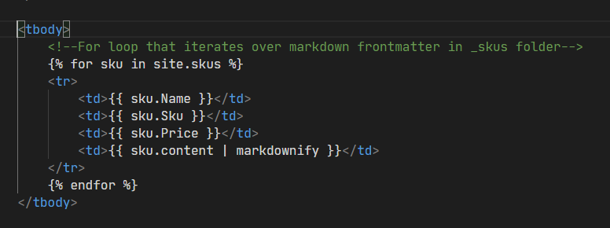
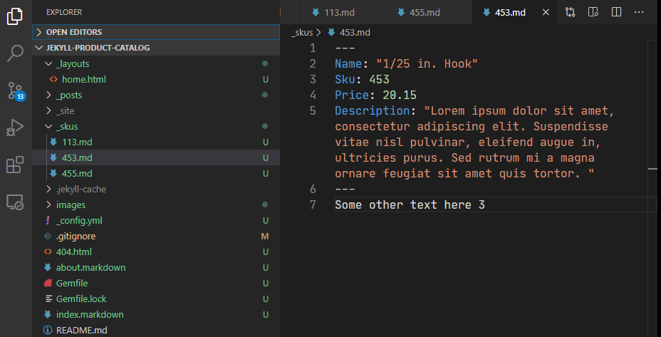

En cours de developement
Bug: la mise a jour sur le git avec le script expect fonctionne. Verifier quelles fichiers a commit, faire le launcher .desktop, ajouter une icone.et completer la docu
# Catalogue en ligne de La Bibliothèque de La Molène
#  Description 
Ce repositoire contient les fichiers et le code nécessaire à la mise en ligne et à la mise à jour du catalogue en ligne de la Bibliothèque de La Molène.

#  Utilisation 
Pour les utilisateuricexs de La Molène qui souhaitent mettre à jour le catalogue.
Mise à jour depuis l'ordinateur de la Molène
1. Ouvrir Tellico depuis l'icone du bureau
2. Utiliser l'onglet Fichier ': Exporter puis sélectionner .csv. Enregistrer le fichier sous "catalogue_molene.csv". Le nom du fichier est tres important.
3. Dans les applications cherche le programme "mise a jour du catalogue" avec l'icone jaune et double-cliquez dessus.
4. si la mise a jour a fonctionne un message apparait

# Technical Information
# # Data processing
The raw data is exported from the collection management software [Tellico]( https://tellico-project.org/) in csv format. A python script extracts the relevant information, i.e. first name, last name, title and category, and creates the markdown file for each book.

# # User interface
The run_update.sh script automates the update. It runs the python script using the updated raw data provided and push the updated files on git. Note that the script needs to be run with the expect command (that deals with the interactive part of the update). 

##  jekyll-product-catalog
This repo builds a "flat" product catalog using jekyll to convert markdown frontmatter into product properties and information generated inside a responsive table

This jekyll site uses collections to iterate over markdown file front matter and populates that data in a table using the DataTables plug-in. This is a good set up for a business who wants to post information such as specs of parts used in manufacturing. It is a static site, so loading thousands of parts is as fast as possible, secure since there is no back end, and can be organized as the owner sees fit using the `_skus` folder as the repository for parts data. It also uses bulma css framework to look nice.

Here is what the FOR loop looks like that using Jekyll's Liquid engine:

And here is a look at one of the markdown files with it's frontmatter

